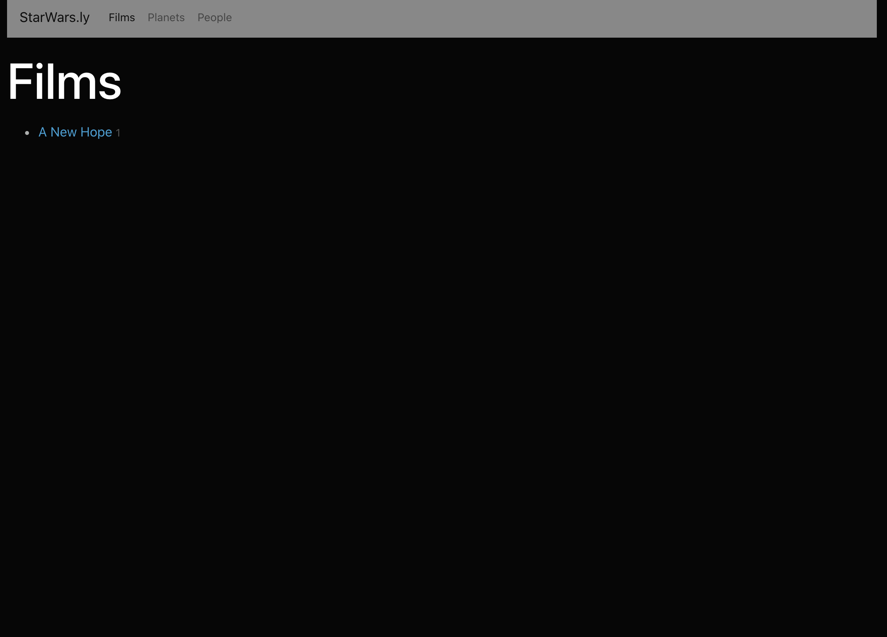

This project was bootstrapped with [Create React App](https://github.com/facebook/create-react-app).

## Available Scripts

In the project directory, you can run:

### `npm start`

Runs the app in the development mode. 
Open [http://localhost:3000](http://localhost:3000) to view it in the browser.

The page will reload if you make edits. 
You will also see any lint errors in the console.

### `npm test`

Launches the test runner in the interactive watch mode. 
See the section about [running tests](https://facebook.github.io/create-react-app/docs/running-tests) for more information.

### `npm run build`

Builds the app for production to the `build` folder. 
It correctly bundles React in production mode and optimizes the build for the best performance.

The build is minified and the filenames include the hashes. 
Your app is ready to be deployed!

See the section about [deployment](https://facebook.github.io/create-react-app/docs/deployment) for more information.

### `npm run eject`

**Note: this is a one-way operation. Once you `eject`, you can’t go back!**

If you aren’t satisfied with the build tool and configuration choices, you can `eject` at any time. This command will remove the single build dependency from your project.

Instead, it will copy all the configuration files and the transitive dependencies (webpack, Babel, ESLint, etc) right into your project so you have full control over them. All of the commands except `eject` will still work, but they will point to the copied scripts so you can tweak them. At this point you’re on your own.

You don’t have to ever use `eject`. The curated feature set is suitable for small and middle deployments, and you shouldn’t feel obligated to use this feature. However we understand that this tool wouldn’t be useful if you couldn’t customize it when you are ready for it.

## Learn More

You can learn more in the [Create React App documentation](https://facebook.github.io/create-react-app/docs/getting-started).

To learn React, check out the [React documentation](https://reactjs.org/).

### Code Splitting

This section has moved here: https://facebook.github.io/create-react-app/docs/code-splitting

### Analyzing the Bundle Size

This section has moved here: https://facebook.github.io/create-react-app/docs/analyzing-the-bundle-size

### Making a Progressive Web App

This section has moved here: https://facebook.github.io/create-react-app/docs/making-a-progressive-web-app

### Advanced Configuration

This section has moved here: https://facebook.github.io/create-react-app/docs/advanced-configuration

### Deployment

This section has moved here: https://facebook.github.io/create-react-app/docs/deployment

### `npm run build` fails to minify

This section has moved here: https://facebook.github.io/create-react-app/docs/troubleshooting#npm-run-build-fails-to-minify

---

# Starwarsly

### Techstack:

- React (create-react-app)
- Redux
- Redux-persist
- Redux-thunk
- React-router
- axios (to ping the Star Wars Api)

### App flow

`Starwarsly` is an online adventure through the Star Wars saga. The landing page conditionally displays either a reset button if a user has previously visited any part of the app, or a button to start exploring the saga.

(loaded)

(not yet loaded)

On all pages, there is a navbar to take a user either to the home landing page (by clicking the Brand), or to the list pages of Films, Planets, and People from the star wars universe. If any film, planet, or character is visited, it is added to its corresponding page. Until then, a message is displayed saying none have been explored yet.

(not yet explored)

(not yet loaded)

Upon exploring a film, person, or planet, details about it are pulled from the Star Wars API to and displayed to the user, with links to other relevant resources relating to it (for a film, there are links to planets and characters, for a planet, there are links to characters from there and to films its seen in, etc). However, until a resource in those lists has been explored, its title is displayed as "unknown" to keep the adventure alive!

(nothing visited yet

If a user wants to start over in their exploration of a galaxy far, far away, they simply need to go to the home page and click the reset button, which will dispatch an action and reset all the state in the redux store.

If a user leaves the app and comes back, their progress will be as they left it. This is due to the use of redux-persist to keep the redux store in localStorage.

## NOTE:

All UI design is built the Bootstrap css framework, with some custom css built in as well.
